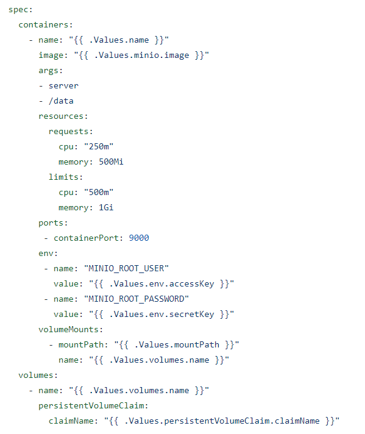
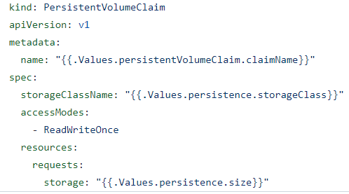
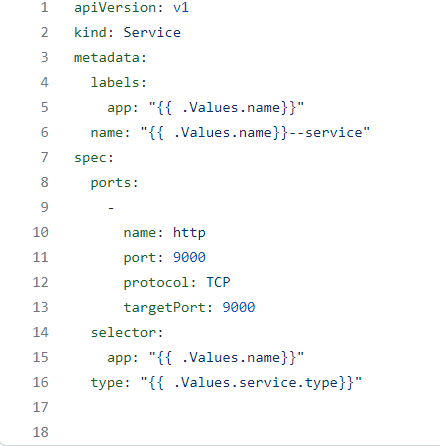

# miniO_helm
A description of how to deploy miniO in the cloud


To deploy the miniO it was needed to create a helm chart and a template folder containing three manifestos: pvc, service and deployment.
The PVC makes a request to the storage class. 

The service type is loadbalancer. Some issues were faced when accessing to the service in the minikube and it was required to use kubectl port-forward. 

To run miniO in minikube make sure it is isntalled and run the following commands:
P.S: You need to have minikube running, for that just type in the terminal minikube start
```
helm create NAME

```
It will generate a helm chart for you and you can replace the helm templates with these ones.
After doing that, it's time to install helm in the minikube.

```
helm  install name ./root where helm chart is located

```
To install helm you need to be a root above of the helm chart

A more concrete example is the following:

```
helm  install minio ./minio

```
Where minio is the name of the helm chart we defined when created helm and ./minio is the folder that resides helm chart.

After having your pod running, go to pod/logs and you will see two urls with two different ports(the port from the container and another port set up by the cluster).
In case you having issues open the url you can request the following command to open the service for you.


```

kubectl port-forward <pod-name> 90000:32983

```
where 9000 is the container and target port and 32983 is a port artibutarly given by the cluster that you can access in the pod/logs.

## Deployment




The following figure contains an example of the deployment which was used to deploy the miniO. As we can see under the container we had to set the env variables which correspond to the login and password of the user. To mount the data, we had to create a volume mounts that will save the data of the container in a persistent state. The volume will claim the storage class that is defined in the persistent volume claim and volume mounts will consume that resource storage.


## Persistent Volume Claim



The persistent volume claim is used to make a storage request in the cluster. It's bounded to a pod which you can define it on the deployment as shown above. To bind a volume claim you can do it dynamically or via static. If done via static, the cluster administrator creates a persistent volume according to the specifications that are set on the persistent volume claim. In our case, we opted for the dynamic binding. To do such, in the manisfest yaml you need to specify the name of the storage class (It's assumed your cluster already has a storage class, if not you need to create one) and the cluster will bind a persistent volume according to your specifications.

## Service



The service type is a LoadBalancer. Service works as an abstraction of the Pods IP in the sense that if clients wanted to connect with a Pod directly, due to the short life cyle of pods, there would be constantly problems due to the pods restarting and shifting its IP. Service, in the other hand, allows for a static IP. To connect our Pod to the external world we can use either LoadBalancer or a NodePort. 

The target Port must correspond to the container Port because that's the port that the pod is listening to and the port that the service receives requests and sends it to the pod. To match a service with a pod the selector must be same as the pod's name.

The Port and TargetPort can be the same port or of different ports, only the Targetport and container port must match. The difference between the port and the targetPort is that the Port is the Port that the service listens to (service is open at a specific port) and the forwards the requests to TargerPort. Then the TargetPort is responsible to forward these requests to the container.


To install the minioAPI and the miniOConsolePort two services had to be deployed. One service --MinioConsole-- is responsible to run the UI of minio and the miniOAPI is responsible to connect the client to the server.


## Minio Client

In the folder test_client there is a python file that emulates a client where it creates a bucket and sends it to the server. 

```

python3 test_client.py

```

The client is a single constructor that takes three required parameters to set up the connection between the client and the server. The first is the endpoint which should be minioAPI url, the access key and the secret key.


